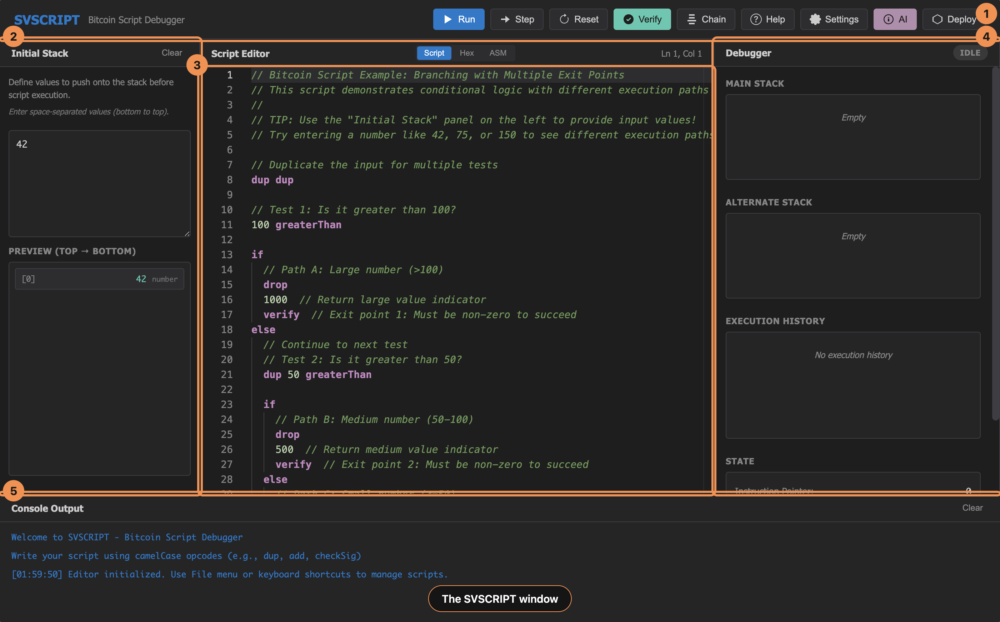
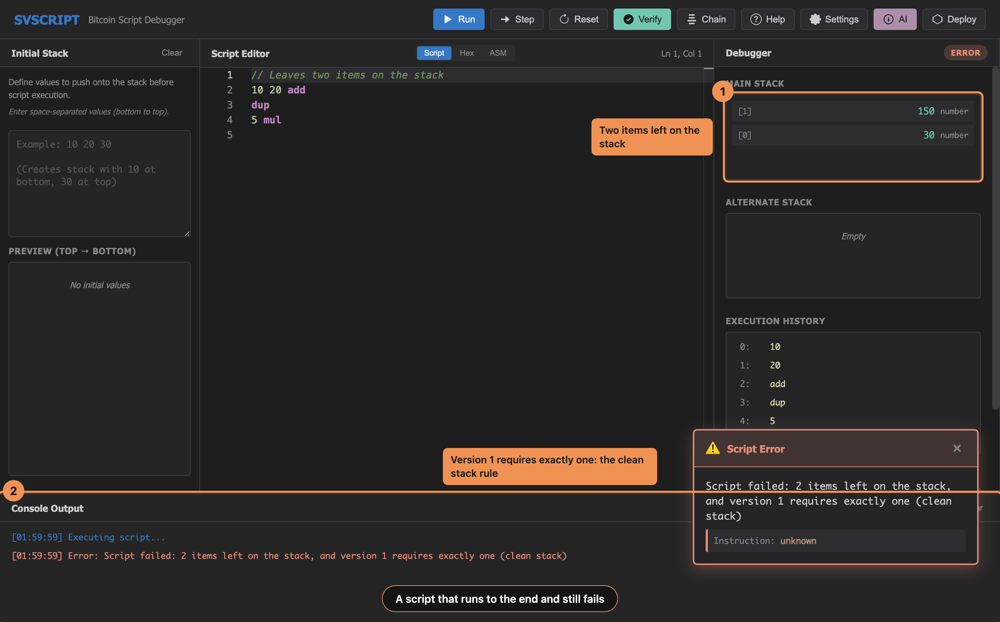
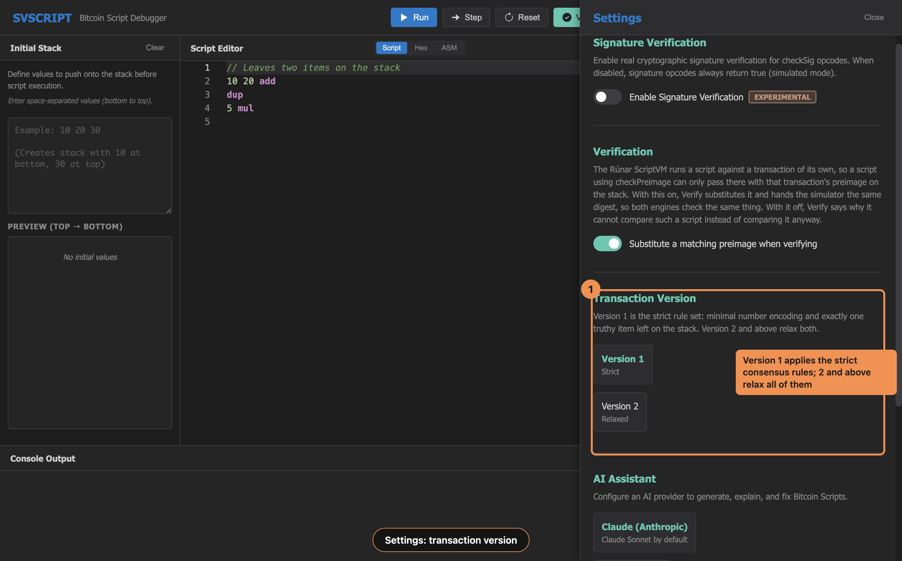
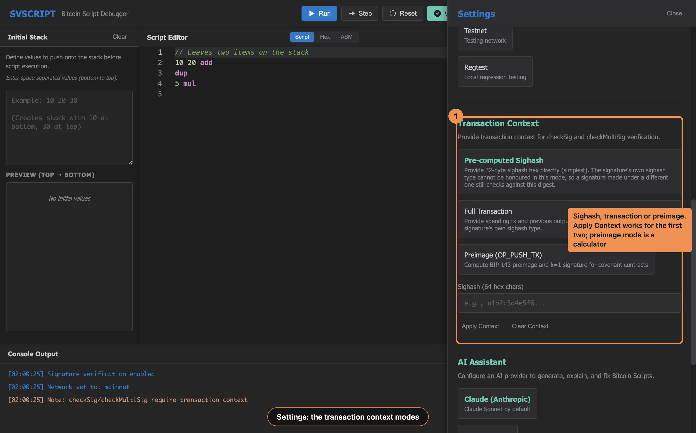
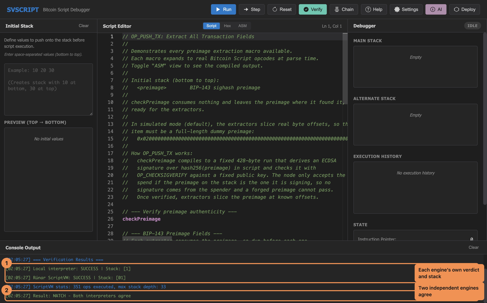
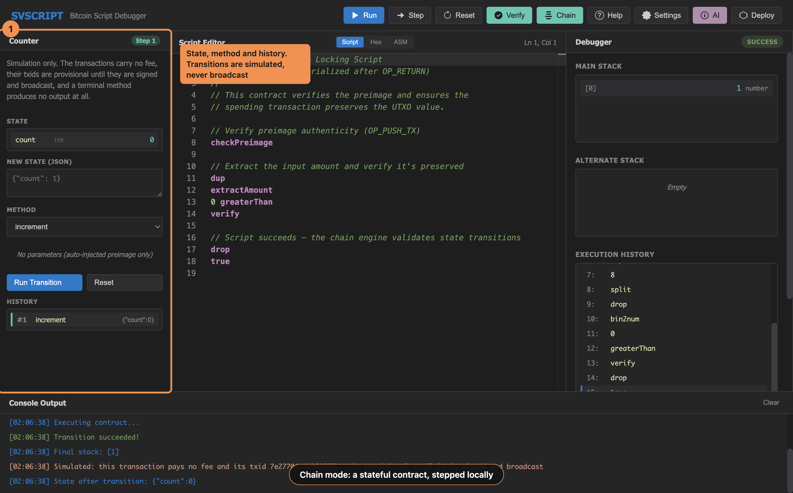
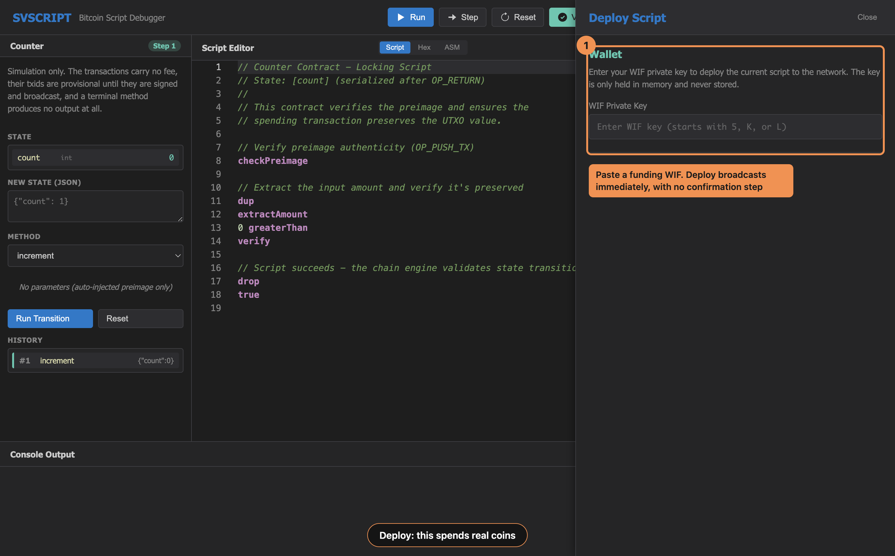

# SVSCRIPT User Guide

How to use SVSCRIPT to write, run, debug, verify and deploy Bitcoin SV Script.

`QUICKSTART.md` gets you running in five minutes. This guide covers the whole
application. `readme.md` has the opcode reference; `development.md` is for
changing the app itself.

## Contents

1. [The window](#the-window)
2. [Writing and running a script](#writing-and-running-a-script)
3. [The end-of-script verdict](#the-end-of-script-verdict)
4. [Transaction version](#transaction-version)
5. [Signatures](#signatures)
6. [Verify: checking against a second engine](#verify-checking-against-a-second-engine)
7. [Covenants and OP_PUSH_TX](#covenants-and-op_push_tx)
8. [Chain mode](#chain-mode)
9. [Deploying a script](#deploying-a-script)
10. [The AI assistant](#the-ai-assistant)
11. [Macros and imports](#macros-and-imports)
12. [Troubleshooting](#troubleshooting)

## The window



Five areas, left to right and top to bottom. The numbers above match the list
below: **1** toolbar, **2** initial stack, **3** editor, **4** debugger,
**5** console.

**Toolbar.** Run, Step, Reset, Verify, Chain Mode, Help, Settings, AI, Deploy.

**Initial stack** (left). The values pushed before the first instruction runs.
Space separated, bottom of the stack first. Each item is either a decimal
number (`42`, `-7`) or a `0x` hex literal (`0xdeadbeef`). Anything else is
dropped and the console says which item and why. The preview underneath shows
the resulting stack top first, which is the order the debugger displays it in.

**Editor** (centre). Monaco, with Bitcoin Script highlighting and completion. A
green glyph in the gutter marks the instruction about to execute.

**Debugger** (right). Main stack, alternate stack, execution history, and the
state counters: instruction pointer, total instructions, instructions executed.

**Console** (bottom). Results, errors, warnings and status. Everything the
application tells you appears here, so read it when something is unexpected.

### Settings do not persist

Settings live in memory for the session. Closing SVSCRIPT resets the
transaction version, the network, signature verification, the transaction
context and the AI key. Set them again after a restart.

## Writing and running a script

Opcodes are camelCase, not `OP_` constants: `dup hash160 equalVerify checkSig`.
Comments are `//` to end of line. Integers and `0x` hex literals push data.

### Run

**Cmd/Ctrl + Enter** executes the whole script, then applies the end-of-script
verdict. The console reports success or the error, and the editor marks the
instruction that failed.

### Step

**F10** executes one instruction. Press it repeatedly and watch the stack
change. The verdict is applied after the last instruction, exactly as in Run,
so a script that runs to the end but leaves a bad stack fails at the same point
either way.

**Cmd/Ctrl + R** resets: empty stacks, instruction pointer back to zero,
history cleared. The editor and the initial stack are untouched.

### Reading the debugger

The stack displays top first. The execution history records every opcode with a
description of what it actually did, with the values substituted in, so
`add` reads as `15 + 27 = 42`. When a script goes wrong, the history entry
before the error usually shows why.

## The end-of-script verdict

Running to the end is not the same as passing. Three checks apply once the last
instruction has run:

1. The stack must not be empty.
2. The top item must be true.
3. At transaction version 1, exactly one item may remain. This is the clean
   stack rule.

Rule 3 is the one that surprises people. A teaching script that leaves six
intermediate results on the stack is correct arithmetic and an invalid script.
Either reduce it to one value or switch to transaction version 2.



Here `10 20 add dup 5 mul` ran every instruction without error. Two items were
left, so at version 1 the verdict is still a failure, and the console names the
rule.

The shipped examples that need version 2 declare it in a comment at the top:

```javascript
// Transaction version: 2
```

## Transaction version

Settings > Transaction Version chooses which consensus rules the script is
judged under. It changes behaviour, not just a displayed number.

**Version 1** applies the strict rules:

- pushes must use the smallest encoding that holds the data
- numbers must not carry a byte they do not need
- signatures must be low-S
- `checkMultiSig` must leave a null dummy (NULLDUMMY)
- unlocking scripts must be push-only
- exactly one item may remain on the stack
- a signature may not use the Chronicle sighash type (bit 0x20)

**Version 2 and above** relax all seven.

Use version 1 when you want to know whether a script would be accepted on
chain. Use version 2 when you are exploring, teaching, or deliberately leaving
working values on the stack.



## Signatures

By default `checkSig`, `checkSigVerify`, `checkMultiSig` and
`checkMultiSigVerify` are **simulated**. They check that the signature is
shaped like a signature and succeed. This lets you test the logic of a script
without building a transaction.

To check signatures for real, turn on **Settings > Signature Verification** and
give the interpreter a transaction context. Without a context the opcodes have
nothing to verify against.

### The three context modes

**Sighash.** Paste the 32-byte sighash directly, as 64 hex characters. Press
Apply Context. Use this when you already know the hash that was signed.

**Transaction.** Paste the raw spending transaction, the input index, the
previous output's locking script and its satoshi value. SVSCRIPT computes the
sighash itself. Press Apply Context.

**Preimage.** Fill in the same four fields and press **Compute Preimage**. The
panel shows the preimage and its signature, and **Inject to Stack** puts the
preimage onto the initial stack for a covenant to read.

Preimage mode is a calculator, not a context. **Apply Context does nothing in
preimage mode** — it applies only sighash and transaction mode. To have
signatures checked for real while working with a preimage, apply a sighash or
transaction context as well.

**Clear Context** removes the context and empties the input fields.



## Verify: checking against a second engine

**Cmd/Ctrl + Shift + V**, or the Verify button, compiles the script and runs it
through Rúnar's `ScriptVM` as well as the built-in interpreter, then compares
the two verdicts. Two independent implementations agreeing is much stronger
evidence than one implementation succeeding.

The `ScriptVM` is vendored under `src/vendor/runar`, so Verify needs no setup
beyond `npm install`.

### Reading the output



```
=== Verification Results ===
Local interpreter: SUCCESS | Stack: [1]
Rúnar ScriptVM:    SUCCESS | Stack: [01]
ScriptVM stats: 351 ops executed, max stack depth: 7
Result: MATCH - Both interpreters agree
```

- **MATCH** — both engines reached the same verdict.
- **MISMATCH** — they disagree. The interpreter is the one to suspect; the
  ScriptVM is the reference.
- **Not compared: ...** — the comparison would have been meaningless, and the
  reason says why.

Verify does not disturb your work. It resets the interpreter afterwards and
restores any transaction context you had configured.

### Why a script is sometimes not compared

**A simulated signature.** If the script checks a signature that the
interpreter is only pretending to verify while the ScriptVM checks it with real
ECDSA, the two must disagree, and that disagreement says nothing about the
script. Verify skips the comparison and tells you. Turn on signature
verification and supply a real signature to compare these scripts.

**The OP_PUSH_TX binding with substitution off.** See below.

### Preimage substitution

The ScriptVM builds its own spending transaction. A script containing
`checkPreimage` therefore needs the preimage of *that* transaction, or the
binding rejects it and the engines disagree for an uninteresting reason.

By default Verify handles this: it derives the matching preimage and
substitutes it for the **top item** of the initial stack, then sets a matching
sighash context so both engines check the same bytes. The console says so:

```
Substituted a preimage matching the verification transaction, because the
binding rejects any other one in both engines
```

Turn this off with **Settings > Verification > Substitute a matching
preimage** if you want to verify with exactly the stack you typed. Verify will
then decline to compare `checkPreimage` scripts and explain why.

## Covenants and OP_PUSH_TX

A covenant constrains how an output may be spent. It works by requiring the
spender to put the transaction preimage on the stack, proving it belongs to the
actual spending transaction, and then reading fields out of it.

### checkPreimage

`checkPreimage` compiles to the OP_PUSH_TX binding: a fixed run of script that
derives a signature from the preimage on the stack and checks it with
`OP_CHECKSIGVERIFY`. A preimage that does not belong to the spending
transaction fails there. It leaves the stack as it found it, preimage included.

In the debugger, `checkPreimage` is only checked when a transaction context is
configured. Without one it is a no-op and the execution history records
`Preimage NOT verified: no transaction context`. Verify always checks it for
real, which is the main reason to use Verify on a covenant.

### Reading fields out of the preimage

Ten macros extract a field, each consuming the preimage. Since `checkPreimage`
leaves the preimage on the stack, `dup` before all but the last read:

| Macro | Leaves |
|---|---|
| `extractVersion` | nVersion, as a number |
| `extractHashPrevouts` | hashPrevouts, 32 bytes |
| `extractHashSequence` | hashSequence, 32 bytes |
| `extractOutpoint` | the outpoint, 36 bytes |
| `extractInputIndex` | the input index, as a number |
| `extractAmount` | the input amount in satoshis, as a number |
| `extractSequence` | nSequence, as a number |
| `extractOutputHash` | hashOutputs, 32 bytes |
| `extractLocktime` | nLocktime, as a number |
| `extractSigHashType` | the sighash type, as a number |

### A worked example

This is `examples/covenant-locktime.bscript` in outline. It refuses to be spent
before block 1000 and requires the input to hold at least 10000 satoshis.

```javascript
// Prove the preimage belongs to this spend
checkPreimage

// locktime >= 1000
dup
extractLocktime
1000 greaterThanOrEqual
verify

// amount >= 10000
extractAmount
10000 greaterThanOrEqual
verify

true
```

To run it in the debugger, put the dummy preimage from the file's header
comment in the initial stack. To check it properly, press Verify: the real
preimage is substituted and the binding is enforced.

## Chain mode

Chain mode steps a stateful contract through its methods. The contract's state
is stored after an `OP_RETURN` in the locking script, and each method is a
spend that moves the state from one value to the next.

**The chain panel simulates transitions locally. Nothing is broadcast.** The
txid it shows is provisional until the transaction is signed and broadcast for
real, and the simulated transactions pay no fee. The console repeats this after
every step.

### Running a chain

1. **File > Open Chain Project**, or the **Chain Mode** button, which opens the
   file dialog when no project is loaded yet. Pick a `.bsm.json` file. The
   initial stack panel is replaced by the chain panel and the contract source
   loads into the editor. Once a project is loaded, the Chain Mode button
   toggles between the two panels.
2. The console lists the project's state fields and methods.
3. Pick a method, fill in its parameters, and set the new state values.
4. Press Run. The contract executes with the method's parameters and the
   preimage of the spending transaction on the stack. The `unlock` file a
   method names is not executed.
5. On success the chain advances: the new state becomes current and the step
   count increases. On failure the console reports why and the state does not
   move.

**Reset** returns the chain to the project's `initialState`.



The console repeats the simulation warning after every step: the transaction
pays no fee and its txid is provisional.

A method marked terminal ends the chain: its transaction carries no output, so
there is nothing left to spend. Reset to continue.

### The project file

`examples/counter-chain/counter.bsm.json` is the shipped example:

```json
{
  "name": "Counter",
  "contract": "./counter.bscript",
  "stateFields": [{ "name": "count", "type": "int" }],
  "methods": [
    { "name": "increment", "unlock": "./methods/increment.bscript", "params": [] },
    { "name": "decrement", "unlock": "./methods/decrement.bscript", "params": [] }
  ],
  "initialState": { "count": 0 },
  "satoshis": 10000
}
```

Paths are relative to the project file. The contract must be a `.bscript`
file inside the project's directory. The `unlock` field is kept in the format
and ignored.

## Deploying a script

Deploy funds and broadcasts the current script as a locking script on the
selected network.

**This spends real coins.** On mainnet the transaction is broadcast the moment
you press Deploy. There is no confirmation step and no undo. Select testnet in
Settings > Bitcoin Network while you are learning.



1. Open **Deploy**.
2. Paste a funding WIF. The address derives from it and the balance loads.
3. Enter the amount to lock. The minimum is 1 satoshi.
4. Press Deploy. The current editor contents are compiled to a locking script,
   funded and broadcast.
5. On success the txid appears with a WhatsOnChain link, and the balance
   refreshes.

The WIF is held only for as long as the operation needs it and is never
written to disk, but it is typed into a running application. Use a funding key
that holds only what you are willing to lose.

## The AI assistant

The AI panel answers Bitcoin Script questions and can generate, explain and fix
scripts. It calls a provider with **your** API key, which you supply in
Settings: Claude or OpenAI, with an optional model override.

The key is not stored. Enter it again after restarting.

Your script is sent to the provider you choose. Do not use it on anything you
would not send to a third party.

## Macros and imports

Both are expanded before the script is parsed, so what runs is plain opcodes.

**Macros.** `xSwap_n`, `xDrop_n`, `xRot_n`, `hashCat`, the ten preimage
extractors, and `LOOP[n]{body}`, which unrolls at compile time. There is no
runtime loop in Bitcoin Script, and the macro does not add one; it writes the
body out `n` times.

**Imports.** Wildcard (`import * from './libs/x.bscript'`), named
(`import name from './libs/x.bscript'`), and multiple named
(`import { a, b } from './libs/x.bscript'`). A library marks a named block with
`// @define name` and `// @end`. Paths are relative to the importing file.

The in-app Help panel has the full syntax with examples.

## Troubleshooting

| What the console says | What it means |
|---|---|
| `Cannot execute 'add' - stack is empty` | Stack underflow. The opcode needs more items than are there. |
| `Script failed: the stack is empty at the end of the script` | Nothing was left to judge. |
| `Script failed: the top stack item is false` | The script ran but evaluated to false. |
| `Script failed: N items left on the stack, and version 1 requires exactly one` | The clean stack rule. Reduce to one item or use version 2. |
| `The signature hash type is invalid before Chronicle` | The signature's sighash byte sets 0x20, which is only valid on version 2 and above. |
| `Initial stack item "..." is not a decimal number or 0x-prefixed hex` | Fix the item or remove it. Everything else still loads. |
| `Preimage NOT verified: no transaction context` | `checkPreimage` was a no-op. Apply a context, or press Verify. |
| `Not compared: this script checks a signature that the simulator only pretends to verify` | Verify declined a meaningless comparison. Turn on signature verification with a real signature. |
| `Rúnar ScriptVM not available` | The vendored `ScriptVM` failed to load. See `src/vendor/runar/README.md`. |
| `Minimum 1 satoshi` | Deploy will not broadcast an output below 1 satoshi. |
| `Result: MISMATCH - Interpreters disagree!` | The ScriptVM is the reference. Treat the interpreter as wrong and report it. |

### A script that passes at version 2 and fails at version 1

Almost always the clean stack rule, a push that is not minimally encoded, or a
number carrying a byte it does not need. The error message names which.

### checkSig succeeds when it should not

Signature verification is off, so the check is simulated. Turn it on in
Settings and supply a transaction context.

## Where to look next

- `readme.md` — the full opcode list and feature reference
- The in-app Help panel — macros, imports and opcode descriptions
- `examples/` — seventeen scripts, a macro library, and a chain project
- `development.md` — extending SVSCRIPT
